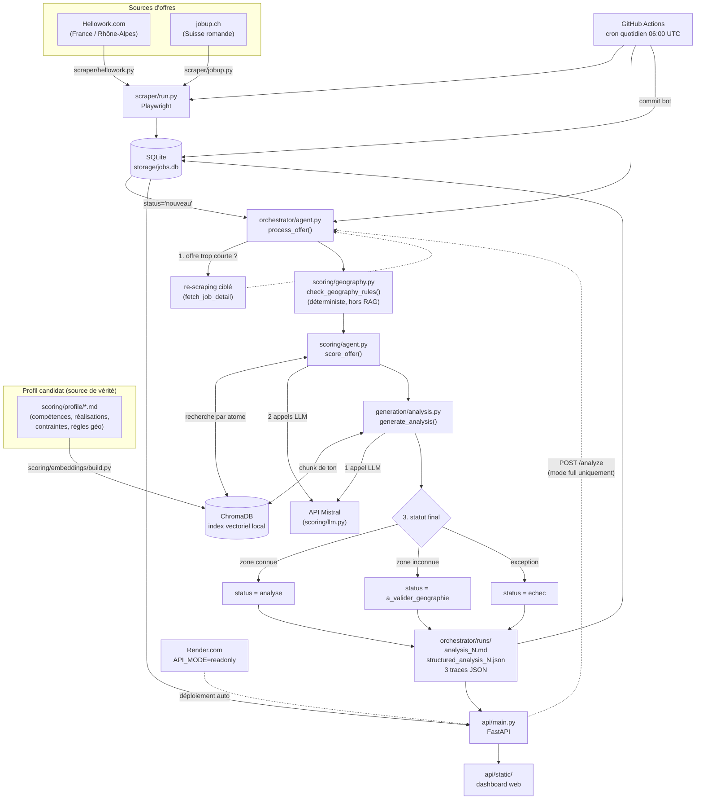

# Documentation technique — job-agent

> Documentation de référence, à jour au 2026-08-20. Complète `CLAUDE.md` (contexte
> métier et règles à ne jamais enfreindre) et `ROADMAP.md` (journal détaillé
> session par session, avec tous les tests réels effectués). Ce document a un
> objectif différent : donner une vue d'ensemble complète et compréhensible de ce
> qui existe, comment ça marche, et pourquoi c'est construit ainsi — pour
> quelqu'un qui reprend le projet à froid, y compris l'auteur lui-même dans six
> mois.

## Sommaire

1. [Objectif du projet](#1-objectif-du-projet)
2. [Vue d'ensemble de l'architecture](#2-vue-densemble-de-larchitecture)
3. [Stack technique](#3-stack-technique)
4. [Le pipeline, étape par étape](#4-le-pipeline-étape-par-étape)
5. [Module par module](#5-module-par-module)
6. [Règles métier critiques](#6-règles-métier-critiques)
7. [Déploiement](#7-déploiement)
8. [Automatisation (GitHub Actions)](#8-automatisation-github-actions)
9. [Tests](#9-tests)
10. [Décisions techniques et pourquoi](#10-décisions-techniques-et-pourquoi)
11. [Limites connues](#11-limites-connues)
12. [État actuel des données](#12-état-actuel-des-données)
13. [Commandes utiles](#13-commandes-utiles)
14. [Glossaire](#14-glossaire)

---

## 1. Objectif du projet

Agent de recherche d'emploi automatisé, avec un double objectif assumé dès le
départ (voir `CLAUDE.md`) :

1. **Outil fonctionnel** : scraper des offres réelles, les scorer par rapport à
   un profil candidat, générer une analyse de candidature honnête, sans jamais
   soumettre quoi que ce soit automatiquement — la validation humaine reste
   obligatoire avant toute action externe.
2. **Vecteur d'apprentissage** : chaque brique (RAG, agents LLM, orchestration,
   API, Docker, CI/CD) est un objectif pédagogique en soi, pas seulement un
   moyen. C'est pourquoi le projet évite délibérément les frameworks lourds
   (pas de LangChain) et implémente le RAG "à la main" avec une vraie
   indexation vectorielle plutôt qu'un simple prompt full-context.

Le profil ciblé est celui de l'utilisateur : Data Analyst/Scientist 3,5+ ans
d'expérience, cherchant en priorité la Suisse romande, puis les Émirats
Arabes Unis/Moyen-Orient, puis Lyon en repli pragmatique (voir §6).

## 2. Vue d'ensemble de l'architecture

Le projet est un pipeline linéaire en 4 étapes, orchestré par un cinquième
module qui prend de vraies décisions sur le déroulement (re-scraping,
statuts, gestion d'échec) plutôt que d'enchaîner les étapes sans condition.
Une API HTTP et un dashboard web exposent le résultat en lecture, et un
workflow GitHub Actions programme l'exécution quotidienne.



**Principe directeur** : chaque module a une responsabilité unique et ne
recalcule jamais ce qu'un module précédent a déjà décidé. Par exemple, la
génération d'analyse ne redétermine jamais la zone géographique — elle
consomme telle quelle celle produite par le scoring, qui lui-même ne la
recalcule jamais après l'avoir obtenue de `check_geography_rules`.

## 3. Stack technique

| Composant | Techno | Rôle | Statut pédagogique |
|---|---|---|---|
| Scraping | Playwright (sync API) | Hellowork + jobup.ch | déjà maîtrisé |
| Stockage offres | SQLite (`storage/jobs.db`) | une table `jobs`, versionnée dans git | déjà maîtrisé |
| Indexation profil | ChromaDB (client persistant local) | RAG sur le profil candidat | **objectif d'apprentissage central** |
| Embeddings | `sentence-transformers` (`paraphrase-multilingual-mpnet-base-v2`), local | vectorisation, gratuit/offline | nouveau |
| LLM | API Mistral (`mistral-large-latest`) | extraction d'exigences, scoring, génération | déjà maîtrisé (usage), nouveau (agentique) |
| Orchestration | boucle Python + dataclasses, pas de framework | décisions de pipeline | nouveau |
| API | FastAPI + uvicorn | HTTP sur l'orchestrateur | nouveau |
| Frontend | HTML/CSS/JS vanilla | dashboard de consultation | — (délibérément simple) |
| Packaging | Docker (`python:3.11-slim`) | déploiement reproductible | nouveau |
| CI/CD | GitHub Actions (cron + `workflow_dispatch`) | scraping/scoring quotidien | nouveau |
| Hébergement | Render.com (tier free) | dashboard public en lecture seule | nouveau |

Toutes les commandes du projet utilisent l'environnement virtuel dédié
`job-agent/.venv` (voir §10 pour pourquoi un venv séparé du reste de la
machine est nécessaire).

## 4. Le pipeline, étape par étape

Pour une offre donnée, du scraping à l'analyse finale :

1. **Scraping** (`scraper/`) — Playwright visite les pages de résultats de
   recherche puis chaque page de détail, extrait titre/entreprise/lieu/
   description/salaire/date, et insère en SQLite via `upsert_job` (ignoré
   silencieusement si `(source, source_id)` existe déjà → pas de doublon au
   re-scraping).

2. **Indexation du profil** (`scoring/embeddings/`) — étape indépendante,
   relancée à chaque changement des fichiers `scoring/profile/*.md` : parse
   les fichiers en chunks (un chunk = une section `## chunk: nom`), les
   vectorise, reconstruit entièrement la collection ChromaDB, et recalcule
   la **baseline de bruit** (voir §5.3) utilisée pour distinguer un vrai
   match d'un bruit de fond.

3. **Orchestration** (`orchestrator/agent.py::process_offer`) — pour chaque
   offre au statut `nouveau` :
   - **Décision 1** : si le texte de l'offre (titre + description) fait
     moins de 300 caractères, tente un re-scraping ciblé de l'URL déjà en
     base avant de scorer (une offre trop courte n'a pas assez de matière
     pour un scoring fiable).
   - **Scoring** (`scoring/agent.py::score_offer`, détaillé en §5.2).
   - **Décision 2** : si la zone géographique déterminée est `inconnu`, le
     pipeline continue quand même (scoring + génération), mais le statut
     final est `a_valider_geographie` plutôt que `analyse` — un humain doit
     vérifier manuellement plutôt que de faire confiance silencieusement à
     un ton par défaut.
   - **Génération** (`generation/analysis.py::generate_analysis`, §5.4).
   - **Décision 3** : toute exception (LLM, réseau, parsing) est capturée,
     tracée intégralement (stack trace complète), l'offre est marquée
     `echec`, et le batch continue avec l'offre suivante plutôt que de
     planter entièrement.

4. **Persistance des résultats** (`orchestrator/run.py::write_outputs`) —
   chaque offre traitée produit jusqu'à 5 fichiers dans `orchestrator/runs/` :
   `analysis_<id>.md` (le markdown lisible), `structured_analysis_<id>.json`
   (matches/gaps/uncertain_flags en JSON, fidèle au `ScoringResult`),
   `trace_orchestrator_<id>.json`, `trace_scoring_<id>.json`,
   `trace_generation_<id>.json` (traçabilité complète pour audit).

5. **Consultation** (`api/` + `api/static/`) — l'API FastAPI lit SQLite +
   les fichiers de `orchestrator/runs/` et les expose via 4 endpoints ; le
   dashboard web les affiche dans un tableau triable/filtrable avec un
   panneau de détail en accordéon.

## 5. Module par module

### 5.1 `storage/db.py` — schéma SQLite

Une seule table `jobs` :

```sql
CREATE TABLE jobs (
    id INTEGER PRIMARY KEY AUTOINCREMENT,
    source TEXT NOT NULL,           -- 'hellowork' | 'jobup'
    source_id TEXT NOT NULL,        -- id natif à la source
    url TEXT NOT NULL,
    title TEXT NOT NULL,
    company TEXT, location TEXT, contract_type TEXT,
    salary TEXT, experience TEXT, description TEXT,
    published_at TEXT,              -- format brut, varie selon la source
    scraped_at TEXT NOT NULL DEFAULT (datetime('now')),  -- 1ère apparition, jamais réécrit
    status TEXT NOT NULL DEFAULT 'nouveau',
    UNIQUE(source, source_id)
);
```

`status` prend 4 valeurs : `nouveau` (pas traité), `analyse` (succès),
`a_valider_geographie` (succès mais zone incertaine), `echec` (exception —
voir la trace orchestrateur pour le détail). La contrainte `UNIQUE(source,
source_id)` est scopée par source, donc deux offres de sources différentes
avec le même `source_id` numérique ne se percutent jamais.

`init_db()` applique une migration explicite (`_migrate_add_status_column`)
pour les bases créées avant l'ajout de la colonne `status` — un simple
`CREATE TABLE IF NOT EXISTS` ne touche pas une table déjà existante.

### 5.2 `scoring/` — l'agent de scoring

Trois fichiers, trois responsabilités distinctes :

**`scoring/geography.py`** — classification géographique **déterministe**,
volontairement hors RAG. Le RAG sémantique s'était montré incapable de
distinguer fiablement Suisse romande et Suisse alémanique (une requête
piège "Zurich, environnement suisse-allemand" faisait remonter la règle
romande en premier). Le matching se fait par mots-clés de ville connue en
priorité, puis code département (Rhône-Alpes uniquement), puis abréviation
cantonale suisse (`VD`/`NE`/`GE`/`FR`/`VS`) en repli. Retourne un
`GeographyVerdict` (zone, rang de priorité, autorisation du signal de
mobilité, méthode de match utilisée) — voir `check_geography_rules_spec.md`
pour la spec formelle et `tests/test_geography.py` pour les 17 cas testés.

**`scoring/llm.py`** — client Mistral minimal, deux fonctions
(`call_llm`/`call_llm_json`). Gère un contournement d'un bug d'empaquetage
du wheel PyPI `mistralai` (import top-level cassé, fallback vers le chemin
interne `mistralai.client.sdk.Mistral`), et un retry à backoff exponentiel
(2s/4s/8s, 3 tentatives) ciblé strictement sur les erreurs HTTP 429 — toute
autre erreur (401, JSON malformé) remonte immédiatement sans retry inutile.

**`scoring/agent.py`** — la boucle de décision principale
(`score_offer`) :

1. Lit le seuil de bruit RAG dynamique (`get_noise_threshold()`, §5.3).
2. Appelle `check_geography_rules` — zone géographique déterminée avant
   tout appel RAG.
3. Si zone `inconnu` : `flag_uncertain("géographie")` sans bloquer la suite.
4. Recherche le chunk de règle de ton via le **nom de la zone**, jamais le
   texte brut de localisation de l'offre.
5. Demande au LLM d'extraire les exigences clés de l'offre (max 10, chacune
   avec un libellé composite d'affichage **et** ses éléments atomiques —
   voir encadré ci-dessous).
6. Pour chaque exigence, recherche RAG **par atome individuel** (pas sur le
   libellé composite groupé), avec seuil de bruit appliqué atome par atome.
7. Arbitrage final par le LLM à partir de tout le contexte rassemblé
   (matches, gaps, seuils dépassés) → score 0-100, matches, gaps,
   résumé du raisonnement.

> **Pourquoi la recherche par atome et pas par phrase composite ?** Une
> phrase longue comme *"gouvernance et gestion des données QMS (ISO 13485,
> FDA 21 CFR Part 820, EU MDR)"* peut trouver un match RAG passable sur
> l'ensemble de la phrase même si aucune des normes citées individuellement
> n'a de vrai équivalent dans le profil — le bruit d'un élément se cache
> dans la longueur de la phrase. La recherche par atome applique le
> principe du **maillon faible** : un seul atome sans match fiable suffit à
> flaguer toute l'exigence incertaine, même si d'autres atomes de la même
> exigence ont bien matché. Un cas réel (offre 24, ISO 13485) a confirmé
> que cette granularité fine détecte un gap que la recherche composite
> manquait silencieusement.

Garde-fous appliqués à la sortie du LLM (`_validate_items`) : tout objet
hors du schéma strict attendu (`{"skill": ..., "matched_chunk_summary":
...}` pour un match, `{"skill": ..., "note": ...}` pour un gap) est
supprimé plutôt que gardé tel quel. Une compétence ne peut jamais
apparaître à la fois en `matches` et en `gaps` — en cas de contradiction,
le gap l'emporte (posture prudente, cohérente avec la règle d'honnêteté).

### 5.3 `scoring/embeddings/` — indexation et recherche vectorielle

**`parser.py`** — découpe chaque fichier `scoring/profile/*.md` sur les
headers `## chunk: nom`, extrait la ligne `Tags: ...`, produit un `Chunk`
avec un id `nom_fichier::nom_chunk`.

**`index.py`** — construit la collection ChromaDB (`build_index`) et
expose la recherche par similarité (`search_profile`/
`search_profile_with_scores`). Deux mécanismes clés :

- **Singletons thread-safe** pour le modèle d'embedding et le client
  ChromaDB (double-checked locking) — évite de repayer ~12s de vérification
  du cache HuggingFace Hub à chaque appel de `search_profile` (constaté :
  jusqu'à des dizaines d'appels par offre). Chargés explicitement au
  démarrage de l'API (`lifespan`), pas paresseusement au premier appel.
- **Seuil de bruit dynamique** (`get_noise_threshold`) : plutôt qu'une
  constante figée, `build_index` interroge la collection fraîchement
  construite avec 5 requêtes hors-sujet volontairement variées (cuisine,
  météo, sport, actualités, jardinage — `NOISE_PROBE_QUERIES`), calcule la
  **médiane** de leurs meilleures distances (médiane, pas moyenne, pour
  résister à un probe aberrant), et persiste cette baseline dans
  `chroma/noise_baseline.json`. Le seuil utilisé au scoring est
  `médiane × 0.85` (marge de sécurité empirique). Repli automatique sur
  l'ancien seuil fixe (0.75) si le fichier de baseline est absent/corrompu
  — jamais de crash pour un fichier de métadonnées manquant. Ce mécanisme
  s'adapte automatiquement si le profil grossit ou si le modèle
  d'embedding change, sans recalibration manuelle.

Modèle d'embedding : `paraphrase-multilingual-mpnet-base-v2` (remplace le
modèle par défaut de ChromaDB, `all-MiniLM-L6-v2`, jugé trop faible en
français et incapable de séparer nettement un vrai match du bruit sur du
texte RH bruité — voir ROADMAP session 2). Empiriquement, un vrai match
tombe autour de 0.33-0.65 de distance cosinus, le bruit autour de 0.75-0.85.

### 5.4 `generation/analysis.py` — génération de l'analyse markdown

`generate_analysis(result, offer_title, offer_description, company_name)`
transforme un `ScoringResult` en analyse markdown structurée à 4 sections
fixes : **Résumé du matching**, **Gaps et incertitudes**, **Questions
d'entretien probables**, **Angle de candidature**.

Points clés :
- Ne recalcule **jamais** la géographie — consomme `result.geography_zone`
  tel quel.
- Récupère le chunk de règle de ton via le même `ZONE_TO_QUERY` que le
  scoring, pour que scoring et génération s'accordent sur la même règle
  pour une même zone.
- `web_search(company_name)` : **stub désactivé**, décision assumée pour ne
  jamais fabriquer de contexte entreprise non vérifié (règle d'honnêteté du
  CLAUDE.md). Appelé et tracé quand l'offre est jugée trop courte/générique
  (< 300 caractères), retourne toujours `None`.
- Le prompt distingue explicitement un **gap confirmé** (compétence
  constatée absente) d'un **flag incertain** (aucun match RAG fiable, ce
  qui n'est pas la même chose qu'une absence confirmée) — cette nuance doit
  survivre jusqu'au texte généré, jamais diluée.
- **Interdiction stricte de toute mention de mobilité** (y compris en
  négation — "sans nécessité de mobilité" viole la règle autant que
  l'affirmer) quand la zone l'impose. Un bug réel a montré que le LLM
  pouvait nier la mobilité au lieu de simplement se taire dessus ; le
  prompt interdit désormais le mot et ses synonymes sous toute forme.
- **Sortie structurée sans second appel LLM** (`StructuredAnalysis`,
  correctif post-session 9) : `matches`/`gaps`/`uncertain_flags` sont
  reconstruits **en Python** directement depuis `ScoringResult`, pas
  re-extraits du markdown généré par un second appel LLM. Un LLM qui
  "réextrairait" la structure depuis sa propre sortie textuelle
  réintroduirait exactement le risque de divergence que cette approche
  élimine — zéro coût, zéro latence additionnelle, divergence
  structurellement impossible plutôt que simplement non observée.

### 5.5 `orchestrator/` — la couche de décision de haut niveau

Voir §4 pour les 3 décisions. Point notable : `orchestrator/agent.py` ne
contient **aucun code qui envoie ou soumet quoi que ce soit à un système
externe** — il s'arrête après avoir produit le markdown et mis à jour le
statut en base (règle CLAUDE.md non négociable).

`orchestrator/run.py` est le point d'entrée CLI, avec un mode offre unique
(`--offer-id N`) et un mode batch (toutes les offres `nouveau`), plus un
délai configurable entre offres (`--delay-seconds`, défaut 2s) pour éviter
de saturer le rate limit Mistral en traitement par lot.

### 5.6 `api/` — l'API HTTP et le dashboard

**`api/main.py`** expose 4 endpoints, en pure exposition de ce que
l'orchestrateur produit déjà (aucune nouvelle logique métier) :

| Endpoint | Rôle |
|---|---|
| `GET /health` | 3 vérifications sans appel réseau : clé Mistral présente, modèle d'embeddings chargé, base accessible. `200` si tout passe, `503` sinon. |
| `GET /offers` | Liste légère (statut, score, zone, dates, compteurs gaps/incertains) pour le dashboard. |
| `GET /offers/{id}` | Détail complet : markdown, matches/gaps/uncertain_flags structurés, 3 traces JSON. 404 seulement si l'`offer_id` n'existe pas. |
| `POST /analyze` | Relance le pipeline complet sur une offre déjà en base. Synchrone (~30-90s), désactivé (503) en mode `readonly`. |

**Mode `API_MODE` (`full` | `readonly`)** — décision née d'une contrainte
réelle de déploiement (Render 512MB max) : en mode `readonly`, les imports
de `torch`/`chromadb`/`sentence-transformers` sont différés à l'intérieur
même des handlers (pas au niveau module), pour que le simple fait
d'importer `api.main` ne charge jamais ces bibliothèques en mémoire. Mesuré
concrètement : ~58MB RAM au repos en `readonly` contre ~750-920MB en
`full`. Utile pour comprendre pourquoi certains imports dans `api/main.py`
sont placés à l'intérieur des fonctions plutôt qu'en haut de fichier — ce
n'est pas un oubli, c'est la source réelle de l'économie mémoire.

**`api/static/`** (session 9) — dashboard HTML/CSS/JS vanilla (pas de
framework, choix délibéré pour un usage mono-page personnel), servi par
`StaticFiles` de FastAPI. Table triable/filtrable par zone/statut, panneau
de détail en accordéon inséré directement sous la ligne cliquée, lien vers
l'offre originale, dates de publication et de première apparition en base
triables chronologiquement (via un champ `published_at_sortable` calculé
côté API, normalisant les deux formats de date des deux sources).

## 6. Règles métier critiques

Ces règles viennent de `CLAUDE.md` et **conditionnent tout le pipeline** —
elles ne sont jamais réinventées ailleurs dans le code :

- **Priorités géographiques**, dans l'ordre : Suisse romande (1) → UAE/Golfe
  (3, priorité absolue en type de rôle mais rang 3 dans `ZONE_CONFIG` faute
  de source de scraping dédiée à ce jour) → Suisse alémanique/italienne (4)
  → Lyon/Rhône-Alpes (2 dans le code, repli pragmatique).
  Implémentées dans `scoring/geography.py::ZONE_CONFIG`.
- **Séparation stricte du signal de mobilité par géographie** :
  - Lyon/France : zéro mention, y compris en négation.
  - Suisse : mobilité personnelle du couple mentionnable.
  - UAE/Moyen-Orient : ouverture à la relocalisation explicite et assumée.
  Implémentée dans `scoring/profile/geography_rules.md` (règles de ton) et
  appliquée par le prompt de `generation/analysis.py`.
- **Honnêteté non négociable** : jamais de fabrication ni d'exagération de
  compétence. Un gap doit être signalé explicitement plutôt que masqué. Le
  score doit refléter un jugement honnête, pas une optimisation cosmétique.
  Implémentée à plusieurs niveaux : `scoring/profile/skills.md` distingue
  explicitement "maîtrisé" de "notions seulement" ; `_validate_items`
  filtre les sorties LLM malformées ; le prompt de génération interdit
  explicitement d'inventer une compétence absente des matches fournis.
- **Jamais de soumission automatique de candidature** : aucun module du
  projet n'envoie quoi que ce soit à un système externe. Le pipeline
  s'arrête à la production de l'analyse markdown + statut en base ; la
  validation humaine est le seul chemin vers une action externe.

## 7. Déploiement

Deux chemins de déploiement distincts, pour deux usages différents :

**Docker local / self-hosted** (`docker/Dockerfile`,
`docker-compose.yml`) — mode `full` : image `python:3.11-slim`, PyTorch
CPU-only installé explicitement depuis l'index dédié PyTorch (sinon `pip`
résout par défaut la variante CUDA, ~9GB de bibliothèques NVIDIA inutiles
ici puisque l'inférence tourne sur CPU), dépendances verrouillées via
`docker/requirements-lock.txt` (un `pip freeze` figé de l'environnement
local qui a résolu le conflit `opentelemetry` entre `chromadb` et
`mistralai`, voir §10), Playwright/Chromium avec ses libs système Debian,
modèle `sentence-transformers` pré-téléchargé au build. Taille finale :
~6.6GB (poids incompressible du stack RAG local + Chromium). Trois volumes
nommés (`storage`, `chroma`, `orchestrator/runs`) pour survivre aux
redémarrages. `docker/entrypoint.sh` construit l'index ChromaDB au premier
démarrage si le volume est neuf.

**Render.com** (`render.yaml`) — mode `readonly` : sert uniquement le
dashboard et les endpoints de lecture (`GET /offers`, `/offers/{id}`,
`/health`) contre les données déjà produites par GitHub Actions. Ne charge
jamais le modèle d'embeddings ni ChromaDB (~58MB RAM au repos, tient
largement dans le tier gratuit 512MB). Redéploiement automatique sur
chaque commit, y compris ceux du bot GitHub Actions — une offre scrapée le
matin apparaît sur le dashboard public sans étape manuelle. Le tier `free`
Render met le service en veille après 15 min d'inactivité (cold start
~30-50s au réveil, propre à l'infrastructure Render).

## 8. Automatisation (GitHub Actions)

`.github/workflows/scrape-and-score.yml` — exécution Python directe (pas
Docker : un runner GitHub jetable n'a pas besoin de l'isolation que Docker
apporterait, et builder/puller ~6.6GB n'apporterait rien de spécifique
ici). Cron quotidien à 06:00 UTC (~08:00 Paris) + déclenchement manuel
(`workflow_dispatch`). Enchaîne : build de l'index ChromaDB (reconstruit à
chaque run depuis les fichiers source versionnés, jamais persisté
lui-même) → scraper (Hellowork + jobup.ch) → orchestrateur batch → commit
bot des fichiers modifiés (`storage/jobs.db` + `orchestrator/runs/`) avec
le message `[skip ci]` pour ne pas redéclencher le workflow lui-même.

**Persistance par commit, pas par cache/artifact** — décision volontaire
(voir ROADMAP session 8) : un run GitHub Actions repart d'un checkout
propre à chaque fois, sans volume local. Committer `jobs.db` +
`orchestrator/runs/` dans le repo donne une source de vérité versionnée,
inspectable via `git log`/`git diff`, sans risque d'éviction — contrairement
à `actions/cache` (LRU, pas fait pour être une source de vérité) ou aux
artifacts (pas de restauration automatique, rétention 90 jours).

`permissions: contents: write` est le seul droit élevé accordé, requis pour
ce commit — cohérent avec la règle "jamais de soumission automatique" : le
workflow ne fait que scraper/scorer/générer/committer pour consultation
ultérieure, jamais d'action vers un tiers.

## 9. Tests

| Fichier | Couvre |
|---|---|
| `tests/test_geography.py` | `check_geography_rules` — 17 cas (11 de la spec + 6 ajoutés session 11 pour la couverture jobup.ch/Suisse romande) |
| `tests/test_generation.py` | Structure du markdown généré (4 sections, ordre), garde-fou anti-fabrication (chevauchement lexical entre `matched_chunk_summary` et le profil source), absence de vocabulaire de mobilité en zone France, fidélité `StructuredAnalysis` ↔ `ScoringResult` |
| `tests/test_llm_retry.py` | Mécanique du retry/backoff sur 429, en mock (4 cas déterministes : succès après 2 échecs, épuisement, 401 non retenté, timing exact du backoff) |
| `tests/test_llm_retry_live.py` | Preuve du retry contre un **vrai** rate limit Mistral (20 appels réels en rafale serrée) — pas un test à lancer en routine (consomme du vrai quota API) |

Aucun test unitaire dédié pour `scraper/` (sélecteurs DOM testés
manuellement contre les sites réels à chaque session, documenté dans
`ROADMAP.md`) ni pour `orchestrator/agent.py` en isolation (testé de bout
en bout via des runs réels sur des offres synthétiques + réelles,
également documentés dans `ROADMAP.md`).

## 10. Décisions techniques et pourquoi

Sélection des décisions les plus susceptibles de surprendre quelqu'un qui
lit le code sans avoir lu tout `ROADMAP.md` :

- **Environnement virtuel dédié (`job-agent/.venv`)** : `chromadb` et
  `mistralai` ont des exigences `opentelemetry` mutuellement incompatibles.
  Un environnement Python global partagé avec d'autres projets casse
  l'import de l'un ou l'autre selon l'ordre d'installation. Toujours
  utiliser `job-agent/.venv/Scripts/python.exe`, jamais le Python global.
- **Fallback d'import `mistralai`** (`scoring/llm.py`) : le wheel PyPI
  `mistralai==2.6.0` n'expose pas `Mistral` depuis le package racine — bug
  d'empaquetage upstream, pas un problème d'environnement. Contourné par un
  `try/except` vers `mistralai.client.sdk.Mistral`.
  Le même fallback fonctionne identiquement en conteneur Docker.
- **Géographie hors RAG** : la similarité sémantique ne peut pas fiablement
  distinguer "Genève" de "Zurich" (les deux sont "la Suisse" pour un
  embedding) — remplacé par du matching déterministe par mots-clés/codes
  postaux, plus lent à écrire mais prévisible et testable exhaustivement.
- **Granularité atomique du matching RAG** (§5.2) : chercher sur le
  libellé composite d'une exigence peut masquer l'absence de match sur un
  de ses éléments constitutifs. La recherche par atome individuel, avec la
  règle du maillon faible, est plus coûteuse en appels RAG (locaux, donc
  gratuits) mais détecte des gaps que l'ancienne approche manquait
  silencieusement.
- **Seuil de bruit RAG dynamique, pas une constante** (§5.3) : recalculé à
  chaque build d'index depuis 5 requêtes hors-sujet, avec repli sur
  l'ancien seuil fixe (0.75) si la baseline est indisponible. S'adapte
  automatiquement à la taille du profil et au modèle d'embedding, plutôt
  que de devoir être recalibré manuellement à chaque changement.
- **Singletons pour le modèle d'embeddings** : la première construction de
  `SentenceTransformerEmbeddingFunction` dans un process paie ~12s de
  vérification HTTP du cache HuggingFace Hub. Un singleton thread-safe
  garantit que ce coût n'est payé qu'une fois par process, pas à chaque
  recherche RAG (dizaines par offre).
- **`API_MODE=readonly`** : la vraie source d'économie mémoire n'est pas un
  blocage de façade sur l'endpoint, mais l'endroit où l'import Python a
  lieu — `torch` se charge en mémoire dès l'import du module, avant toute
  instanciation. Les imports lourds sont donc différés à l'intérieur des
  handlers, exécutés seulement hors mode `readonly`.
- **Zéro appel LLM pour la sortie structurée** (`StructuredAnalysis`,
  §5.4) : l'information existait déjà dans `ScoringResult` — la construire
  en Python plutôt que de la re-extraire du markdown via un second appel
  LLM élimine structurellement le risque de divergence entre le score
  affiché et le texte généré.
- **Docker : PyTorch CPU-only installé séparément** : un `pip install`
  naïf du même pin de version résout par défaut la variante CUDA dans
  l'image Debian slim, même si l'environnement local avait résolu la
  variante CPU — ~9GB de bibliothèques NVIDIA inutiles pour un projet qui
  n'utilise jamais le GPU. Installé explicitement depuis l'index CPU-only
  officiel de PyTorch pour lever l'ambiguïté.
- **Persistance CI par commit git, pas par cache** (§8) : un runner GitHub
  Actions repart de zéro à chaque run, sans volume — le commit du bot est
  la source de vérité versionnée la plus simple et la plus robuste pour ce
  volume de données (quelques centaines de Ko à quelques Mo).

## 11. Limites connues

Non exhaustif — voir `ROADMAP.md` pour le détail complet de chaque
limite, avec son contexte de découverte :

- Pas de source de scraping dédiée UAE/Moyen-Orient à ce jour — la
  priorité géographique la plus haute en type de rôle n'a jamais été
  testée de bout en bout avec de vraies offres (seule la Suisse romande,
  ajoutée en session 11, a été testée en conditions réelles au-delà de
  Rhône-Alpes).
- `POST /analyze` est synchrone (bloque ~30-90s), pas de file de tâches en
  arrière-plan — acceptable pour un usage personnel mono-utilisateur,
  deviendrait un problème sous charge concurrente.
- Le garde-fou anti-fabrication des tests (`tests/test_generation.py`) est
  un contrôle de cohérence lexicale basique (chevauchement de mots-clés),
  pas une vérification sémantique — ne détecterait pas une justification
  qui réutilise des mots du profil dans un sens détourné.
- Le score et les matches/gaps dépendent entièrement du jugement du LLM
  sur la pertinence sémantique des chunks retrouvés — pas de garde-fou
  supplémentaire équivalent à la séparation géographique déterministe.
- Image Docker à ~6.6GB — poids jugé incompressible pour ce stack
  (sentence-transformers + Chromium + torch CPU) sans tentative de build
  multi-stage à ce jour.
- `docker/requirements-lock.txt` est un `pip freeze` figé manuellement, pas
  de mécanisme automatique de synchronisation avec `requirements.txt`.

## 12. État actuel des données

Au 2026-08-20, `storage/jobs.db` contient **107 offres**, toutes au statut
`analyse` : 73 issues de Hellowork (Rhône-Alpes), 34 de jobup.ch (Suisse
romande — Genève/Vaud/Neuchâtel). `orchestrator/runs/` contient les
fichiers d'analyse et de trace correspondants, committés automatiquement
par le workflow GitHub Actions quotidien.

## 13. Commandes utiles

Toujours depuis `job-agent/`, avec l'environnement virtuel dédié.

```bash
# Scraper (les deux sources par défaut)
.venv/Scripts/python.exe -m scraper.run

# Scraper une seule source, avec une requête personnalisée
.venv/Scripts/python.exe -m scraper.run --source jobup --query "data engineer" --pages 2

# Reconstruire l'index ChromaDB (après modification de scoring/profile/*.md)
.venv/Scripts/python.exe -m scoring.embeddings.build

# Scorer + générer l'analyse d'une seule offre
.venv/Scripts/python.exe -m orchestrator.run --offer-id 7

# Traiter toutes les offres au statut 'nouveau'
.venv/Scripts/python.exe -m orchestrator.run --delay-seconds 2

# Lancer l'API + dashboard en local
.venv/Scripts/python.exe -m uvicorn api.main:app --reload
# puis ouvrir http://127.0.0.1:8000

# Lancer les tests
.venv/Scripts/python.exe -m pytest tests/ -v

# Docker (mode full, local)
docker compose up -d
```

## 14. Glossaire

- **Chunk** — unité de découpage du profil candidat, une section
  `## chunk: nom` dans `scoring/profile/*.md`, indexée individuellement
  dans ChromaDB.
- **Zone géographique** — une des 6 valeurs produites par
  `check_geography_rules` : `suisse_romande`, `rhone_alpes`, `uae_gcc`,
  `suisse_autre`, `autre_france`, `inconnu`.
- **Flag incertain (`uncertain_flag`)** — signal produit quand aucun match
  RAG fiable n'a été trouvé pour une exigence, distinct d'un **gap**
  (compétence constatée absente). Un flag incertain ne veut pas dire
  "compétence absente", mais "pas de preuve trouvée".
- **Trace** — journal structuré (JSON) de chaque décision prise par un
  agent (géographie, requêtes RAG avec distances, flags), produit à 3
  niveaux (orchestrateur, scoring, génération) pour un audit complet a
  posteriori.
- **Seuil de bruit (`noise_threshold`)** — distance cosinus au-delà de
  laquelle un résultat RAG est considéré comme non pertinent, calculée
  dynamiquement (§5.3).
- **Atome** — élément technique individuel constitutif d'une exigence
  composite extraite par le LLM (ex. "ISO 13485" est un atome de la
  compétence composite "gouvernance QMS (...)").
